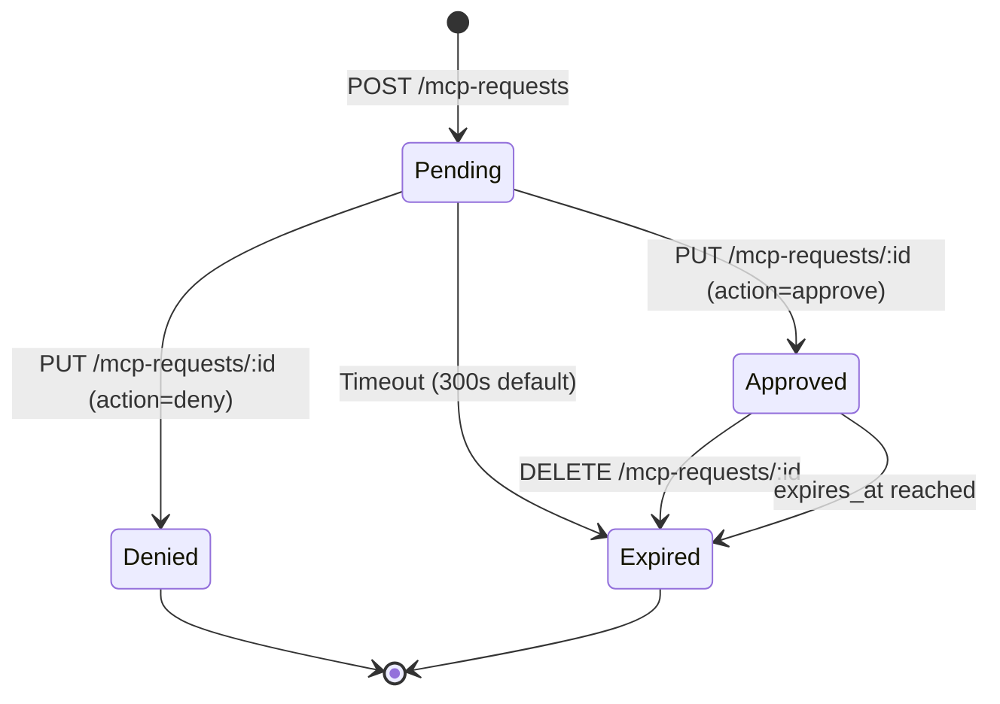

# MCP Endpoints API Documentation

## Overview

The MCP (Model Context Protocol) endpoints enable AI development tools like Claude Code and Cursor to request access to secrets stored in Abyrith with user approval. These endpoints implement a secure approval workflow that maintains zero-knowledge architecture while allowing seamless AI tool integration.

**Base URL:** `https://api.abyrith.com/v1`

**Resource:** MCP Requests and Approvals

**Authentication:** Required (JWT Bearer token)

---

## Table of Contents

1. [Authentication](#authentication)
2. [Common Patterns](#common-patterns)
3. [Endpoints](#endpoints)
4. [Approval Workflow State Machine](#approval-workflow-state-machine)
5. [WebSocket Notifications](#websocket-notifications)
6. [Error Handling](#error-handling)
7. [Rate Limiting](#rate-limiting)
8. [Examples](#examples)
9. [Dependencies](#dependencies)
10. [References](#references)
11. [Change Log](#change-log)

---

## Authentication

### Required Headers

```http
Authorization: Bearer {jwt_token}
Content-Type: application/json
X-MCP-Client: {client_name}     # Optional: 'claude-code', 'cursor', etc.
X-MCP-Version: {version}         # Optional: MCP client version
```

### Token Structure

```typescript
interface JWTPayload {
  sub: string;        // User ID
  email: string;      // User email
  org_id?: string;    // Organization ID (if applicable)
  role: string;       // User role
  iat: number;        // Issued at
  exp: number;        // Expiration
}
```

### Obtaining Tokens

See `05-api/endpoints/auth-endpoints.md` for token acquisition flows.

---

## Common Patterns

### Pagination

**Query Parameters:**
```typescript
interface PaginationParams {
  page?: number;      // Page number (default: 1)
  per_page?: number;  // Items per page (default: 20, max: 100)
}
```

**Response Structure:**
```typescript
interface PaginatedResponse<T> {
  data: T[];
  pagination: {
    page: number;
    per_page: number;
    total: number;
    total_pages: number;
  };
}
```

### Filtering

**Query Parameters:**
```typescript
interface FilterParams {
  approval_status?: 'pending' | 'approved' | 'denied' | 'expired';
  mcp_client_name?: string;
  project_id?: string;
  secret_id?: string;
  created_after?: string;   // ISO 8601 timestamp
  created_before?: string;  // ISO 8601 timestamp
}
```

### Sorting

**Query Parameter:**
```
sort={field}:{direction}
```

**Examples:**
```
GET /v1/mcp-requests?sort=created_at:desc
GET /v1/mcp-requests?sort=approval_status:asc,created_at:desc
```

---

## Endpoints

### 1. Submit MCP Request

**Endpoint:** `POST /v1/mcp-requests`

**Description:** Submit a new MCP request from an AI tool. This creates a pending approval request that the user must approve before the AI tool can access the secret.

**Permissions Required:** `authenticated` (AI tool must be authenticated as user)

**Request:**
```typescript
interface CreateMCPRequestBody {
  project_id: string;               // Project UUID
  secret_id?: string;               // Secret UUID (if requesting specific secret)
  secret_name?: string;             // Secret name (alternative to secret_id)
  environment?: string;             // 'development' | 'staging' | 'production'
  mcp_tool_name: string;            // MCP tool identifier (e.g., 'abyrith_secrets_get')
  mcp_client_name: string;          // Client name (e.g., 'claude-code', 'cursor')
  mcp_client_version?: string;      // Client version
  request_type: 'secret_list' | 'secret_get' | 'secret_search' | 'secret_request' | 'project_list';
  requested_resource?: string;      // Human-readable description
  request_params?: Record<string, any>;  // Additional request parameters
  reason?: string;                  // Why the AI tool needs this access
}
```

**Example Request:**
```json
POST /v1/mcp-requests
{
  "project_id": "550e8400-e29b-41d4-a716-446655440000",
  "secret_name": "OPENAI_API_KEY",
  "environment": "development",
  "mcp_tool_name": "abyrith_secrets_get",
  "mcp_client_name": "claude-code",
  "mcp_client_version": "1.2.0",
  "request_type": "secret_get",
  "requested_resource": "OPENAI_API_KEY (OpenAI, development)",
  "reason": "Generating code with GPT-4"
}
```

**Success Response (201 Created):**
```typescript
interface CreateMCPRequestResponse {
  id: string;
  user_id: string;
  organization_id: string;
  project_id: string;
  secret_id?: string;
  mcp_tool_name: string;
  mcp_client_name: string;
  request_type: string;
  requested_resource?: string;
  approval_status: 'pending';
  approval_url: string;           // URL to approval UI
  timeout: number;                // Seconds until auto-timeout (default: 300)
  created_at: string;
  updated_at: string;
}
```

**Example Response:**
```json
HTTP/1.1 201 Created
Location: /v1/mcp-requests/7f8e9d0c-1b2a-3456-7890-abcdef123456

{
  "id": "7f8e9d0c-1b2a-3456-7890-abcdef123456",
  "user_id": "f47ac10b-58cc-4372-a567-0e02b2c3d479",
  "organization_id": "a1b2c3d4-e5f6-7890-abcd-ef1234567890",
  "project_id": "550e8400-e29b-41d4-a716-446655440000",
  "secret_id": "abc12345-def6-7890-ghij-klmnop123456",
  "mcp_tool_name": "abyrith_secrets_get",
  "mcp_client_name": "claude-code",
  "request_type": "secret_get",
  "requested_resource": "OPENAI_API_KEY (OpenAI, development)",
  "approval_status": "pending",
  "approval_url": "https://app.abyrith.com/approvals/7f8e9d0c-1b2a-3456-7890-abcdef123456",
  "timeout": 300,
  "created_at": "2025-11-02T12:00:00.000Z",
  "updated_at": "2025-11-02T12:00:00.000Z"
}
```

**Error Responses:**
- `400 Bad Request` - Invalid input data
  ```json
  {
    "error": "validation_error",
    "message": "Invalid request payload",
    "details": {
      "project_id": ["Must be a valid UUID"],
      "request_type": ["Must be one of: secret_list, secret_get, secret_search, secret_request, project_list"]
    }
  }
  ```
- `401 Unauthorized` - Missing or invalid token
- `403 Forbidden` - User doesn't have access to this project
- `404 Not Found` - Project or secret doesn't exist
- `409 Conflict` - Active approval already exists for this secret
- `429 Too Many Requests` - Rate limit exceeded (100/hour free, 1000/hour team)
- `500 Internal Server Error` - Server error

**Validation Rules:**
- `project_id`: Required, must be valid UUID, user must have access
- `secret_id` or `secret_name`: One required for `secret_get` request type
- `mcp_tool_name`: Required, max 255 characters
- `mcp_client_name`: Required, max 255 characters
- `request_type`: Required, must be one of the valid types
- `reason`: Optional, max 1000 characters

---

### 2. List MCP Requests

**Endpoint:** `GET /v1/mcp-requests`

**Description:** List MCP requests for the current user or organization (Admins/Owners see all).

**Permissions Required:** `authenticated`

**Query Parameters:**
```typescript
interface ListMCPRequestsParams extends PaginationParams {
  approval_status?: 'pending' | 'approved' | 'denied' | 'expired';
  mcp_client_name?: string;
  project_id?: string;
  created_after?: string;   // ISO 8601
  created_before?: string;  // ISO 8601
  sort?: string;            // e.g., "created_at:desc"
}
```

**Success Response (200 OK):**
```typescript
interface ListMCPRequestsResponse {
  data: Array<{
    id: string;
    user_id: string;
    organization_id: string;
    project_id: string;
    project_name?: string;     // Joined from projects table
    secret_id?: string;
    secret_name?: string;      // Joined from secrets table
    mcp_tool_name: string;
    mcp_client_name: string;
    request_type: string;
    requested_resource?: string;
    approval_status: 'pending' | 'approved' | 'denied' | 'expired';
    approved_by?: string;
    approved_at?: string;
    denied_reason?: string;
    expires_at?: string;
    access_granted: boolean;
    created_at: string;
    updated_at: string;
  }>;
  pagination: {
    page: number;
    per_page: number;
    total: number;
    total_pages: number;
  };
}
```

**Example Response:**
```json
{
  "data": [
    {
      "id": "7f8e9d0c-1b2a-3456-7890-abcdef123456",
      "user_id": "f47ac10b-58cc-4372-a567-0e02b2c3d479",
      "organization_id": "a1b2c3d4-e5f6-7890-abcd-ef1234567890",
      "project_id": "550e8400-e29b-41d4-a716-446655440000",
      "project_name": "RecipeApp",
      "secret_id": "abc12345-def6-7890-ghij-klmnop123456",
      "secret_name": "OPENAI_API_KEY",
      "mcp_tool_name": "abyrith_secrets_get",
      "mcp_client_name": "claude-code",
      "request_type": "secret_get",
      "requested_resource": "OPENAI_API_KEY (OpenAI, development)",
      "approval_status": "pending",
      "access_granted": false,
      "created_at": "2025-11-02T12:00:00.000Z",
      "updated_at": "2025-11-02T12:00:00.000Z"
    }
  ],
  "pagination": {
    "page": 1,
    "per_page": 20,
    "total": 1,
    "total_pages": 1
  }
}
```

**Error Responses:**
- `400 Bad Request` - Invalid query parameters
- `401 Unauthorized` - Missing or invalid token
- `500 Internal Server Error` - Server error

---

### 3. Get MCP Request Details

**Endpoint:** `GET /v1/mcp-requests/:id`

**Description:** Retrieve details of a specific MCP request.

**Permissions Required:** `authenticated` (user owns request or is Admin/Owner)

**Path Parameters:**
- `id` (string, required) - MCP request ID (UUID)

**Success Response (200 OK):**
```typescript
interface GetMCPRequestResponse {
  id: string;
  user_id: string;
  organization_id: string;
  project_id: string;
  project_name?: string;
  secret_id?: string;
  secret_name?: string;
  mcp_tool_name: string;
  mcp_client_name: string;
  mcp_client_version?: string;
  request_type: string;
  requested_resource?: string;
  request_params?: Record<string, any>;
  approval_status: 'pending' | 'approved' | 'denied' | 'expired';
  approved_by?: string;
  approved_by_name?: string;    // Joined from users table
  approved_at?: string;
  denied_reason?: string;
  expires_at?: string;
  access_granted: boolean;
  error_message?: string;
  ip_address?: string;
  user_agent?: string;
  session_id?: string;
  created_at: string;
  updated_at: string;
}
```

**Example Response:**
```json
{
  "id": "7f8e9d0c-1b2a-3456-7890-abcdef123456",
  "user_id": "f47ac10b-58cc-4372-a567-0e02b2c3d479",
  "organization_id": "a1b2c3d4-e5f6-7890-abcd-ef1234567890",
  "project_id": "550e8400-e29b-41d4-a716-446655440000",
  "project_name": "RecipeApp",
  "secret_id": "abc12345-def6-7890-ghij-klmnop123456",
  "secret_name": "OPENAI_API_KEY",
  "mcp_tool_name": "abyrith_secrets_get",
  "mcp_client_name": "claude-code",
  "mcp_client_version": "1.2.0",
  "request_type": "secret_get",
  "requested_resource": "OPENAI_API_KEY (OpenAI, development)",
  "request_params": {
    "environment": "development",
    "reason": "Generating code with GPT-4"
  },
  "approval_status": "approved",
  "approved_by": "f47ac10b-58cc-4372-a567-0e02b2c3d479",
  "approved_by_name": "Jane Doe",
  "approved_at": "2025-11-02T12:01:30.000Z",
  "expires_at": "2025-11-02T13:01:30.000Z",
  "access_granted": true,
  "ip_address": "192.168.1.100",
  "user_agent": "AbyrithMCP/1.0.0",
  "created_at": "2025-11-02T12:00:00.000Z",
  "updated_at": "2025-11-02T12:01:30.000Z"
}
```

**Error Responses:**
- `401 Unauthorized` - Missing or invalid token
- `403 Forbidden` - User doesn't have access to this request
- `404 Not Found` - MCP request doesn't exist
- `500 Internal Server Error` - Server error

---

### 4. Approve or Deny MCP Request

**Endpoint:** `PUT /v1/mcp-requests/:id`

**Description:** Approve or deny an MCP request. This endpoint is called by the user from the Abyrith web app approval UI.

**Permissions Required:** `authenticated` (user owns request or is Admin/Owner)

**Path Parameters:**
- `id` (string, required) - MCP request ID (UUID)

**Request:**
```typescript
interface UpdateMCPRequestBody {
  action: 'approve' | 'deny';
  duration?: number;              // Seconds until expiration (for approve only)
                                  // Options: 3600 (1h), 86400 (24h), null (always)
  denied_reason?: string;         // Reason for denial (for deny only)
}
```

**Example Request (Approve for 1 hour):**
```json
PUT /v1/mcp-requests/7f8e9d0c-1b2a-3456-7890-abcdef123456
{
  "action": "approve",
  "duration": 3600
}
```

**Example Request (Deny):**
```json
PUT /v1/mcp-requests/7f8e9d0c-1b2a-3456-7890-abcdef123456
{
  "action": "deny",
  "denied_reason": "Not authorized for production secrets"
}
```

**Success Response (200 OK):**
```typescript
interface UpdateMCPRequestResponse {
  id: string;
  approval_status: 'approved' | 'denied';
  approved_by?: string;
  approved_at?: string;
  denied_reason?: string;
  expires_at?: string;
  access_granted: boolean;
  updated_at: string;
}
```

**Example Response (Approved):**
```json
{
  "id": "7f8e9d0c-1b2a-3456-7890-abcdef123456",
  "approval_status": "approved",
  "approved_by": "f47ac10b-58cc-4372-a567-0e02b2c3d479",
  "approved_at": "2025-11-02T12:01:30.000Z",
  "expires_at": "2025-11-02T13:01:30.000Z",
  "access_granted": true,
  "updated_at": "2025-11-02T12:01:30.000Z"
}
```

**Example Response (Denied):**
```json
{
  "id": "7f8e9d0c-1b2a-3456-7890-abcdef123456",
  "approval_status": "denied",
  "denied_reason": "Not authorized for production secrets",
  "access_granted": false,
  "updated_at": "2025-11-02T12:01:30.000Z"
}
```

**Error Responses:**
- `400 Bad Request` - Invalid action or duration
  ```json
  {
    "error": "validation_error",
    "message": "Invalid duration",
    "details": {
      "duration": ["Must be 3600 (1h), 86400 (24h), or null (always)"]
    }
  }
  ```
- `401 Unauthorized` - Missing or invalid token
- `403 Forbidden` - User doesn't have permission to approve this request
- `404 Not Found` - MCP request doesn't exist
- `409 Conflict` - Request already approved or denied
- `500 Internal Server Error` - Server error

**Validation Rules:**
- `action`: Required, must be 'approve' or 'deny'
- `duration`: Optional for approve, must be 3600, 86400, or null
- `denied_reason`: Required for deny, max 1000 characters

---

### 5. Check Request Status

**Endpoint:** `GET /v1/mcp-requests/:id/status`

**Description:** Check the approval status of an MCP request. Used by AI tools for polling.

**Permissions Required:** `authenticated` (user owns request)

**Path Parameters:**
- `id` (string, required) - MCP request ID (UUID)

**Success Response (200 OK):**
```typescript
interface CheckStatusResponse {
  id: string;
  approval_status: 'pending' | 'approved' | 'denied' | 'expired';
  approved: boolean;            // True if approved and not expired
  expires_at?: string;
  expires_in?: number;          // Seconds until expiration (null if always)
  denied_reason?: string;
}
```

**Example Response (Pending):**
```json
{
  "id": "7f8e9d0c-1b2a-3456-7890-abcdef123456",
  "approval_status": "pending",
  "approved": false
}
```

**Example Response (Approved):**
```json
{
  "id": "7f8e9d0c-1b2a-3456-7890-abcdef123456",
  "approval_status": "approved",
  "approved": true,
  "expires_at": "2025-11-02T13:01:30.000Z",
  "expires_in": 3540
}
```

**Example Response (Denied):**
```json
{
  "id": "7f8e9d0c-1b2a-3456-7890-abcdef123456",
  "approval_status": "denied",
  "approved": false,
  "denied_reason": "Not authorized for production secrets"
}
```

**Example Response (Expired):**
```json
{
  "id": "7f8e9d0c-1b2a-3456-7890-abcdef123456",
  "approval_status": "expired",
  "approved": false,
  "expires_at": "2025-11-02T13:01:30.000Z"
}
```

**Error Responses:**
- `401 Unauthorized` - Missing or invalid token
- `403 Forbidden` - User doesn't own this request
- `404 Not Found` - MCP request doesn't exist
- `500 Internal Server Error` - Server error

**Implementation Note:**
AI tools should poll this endpoint every 2-5 seconds while waiting for approval. Consider implementing exponential backoff to reduce load.

---

### 6. Revoke Approved Access

**Endpoint:** `DELETE /v1/mcp-requests/:id`

**Description:** Revoke an approved MCP request. This immediately expires the approval and prevents further access.

**Permissions Required:** `authenticated` (user owns request or is Admin/Owner)

**Path Parameters:**
- `id` (string, required) - MCP request ID (UUID)

**Success Response (204 No Content):**
```
[Empty response body]
```

**Error Responses:**
- `401 Unauthorized` - Missing or invalid token
- `403 Forbidden` - User doesn't have permission to revoke this request
- `404 Not Found` - MCP request doesn't exist
- `409 Conflict` - Request not in approved state (can only revoke approved requests)
- `500 Internal Server Error` - Server error

**Implementation Note:**
This sets `approval_status` to `'expired'` and clears `expires_at`. The MCP server's approval cache should be invalidated.

---

### 7. List Historical MCP Requests

**Endpoint:** `GET /v1/mcp-requests/history`

**Description:** List all historical MCP requests for compliance and audit purposes. Includes all statuses.

**Permissions Required:** `admin` or `owner` role

**Query Parameters:**
```typescript
interface HistoricalMCPRequestsParams extends PaginationParams {
  user_id?: string;             // Filter by specific user
  project_id?: string;          // Filter by project
  mcp_client_name?: string;     // Filter by AI tool
  start_date?: string;          // ISO 8601 (default: 30 days ago)
  end_date?: string;            // ISO 8601 (default: now)
  include_denied?: boolean;     // Include denied requests (default: true)
  include_expired?: boolean;    // Include expired requests (default: true)
  sort?: string;                // Default: "created_at:desc"
}
```

**Success Response (200 OK):**
```typescript
interface HistoricalMCPRequestsResponse {
  data: Array<{
    id: string;
    user_id: string;
    user_email: string;         // Joined from users table
    organization_id: string;
    project_id: string;
    project_name: string;
    secret_id?: string;
    secret_name?: string;
    mcp_tool_name: string;
    mcp_client_name: string;
    request_type: string;
    approval_status: string;
    approved_by?: string;
    approved_by_email?: string;
    approved_at?: string;
    denied_reason?: string;
    access_granted: boolean;
    created_at: string;
    updated_at: string;
  }>;
  pagination: {
    page: number;
    per_page: number;
    total: number;
    total_pages: number;
  };
  summary: {
    total_requests: number;
    approved: number;
    denied: number;
    expired: number;
    pending: number;
  };
}
```

**Example Response:**
```json
{
  "data": [
    {
      "id": "7f8e9d0c-1b2a-3456-7890-abcdef123456",
      "user_id": "f47ac10b-58cc-4372-a567-0e02b2c3d479",
      "user_email": "user@example.com",
      "organization_id": "a1b2c3d4-e5f6-7890-abcd-ef1234567890",
      "project_id": "550e8400-e29b-41d4-a716-446655440000",
      "project_name": "RecipeApp",
      "secret_id": "abc12345-def6-7890-ghij-klmnop123456",
      "secret_name": "OPENAI_API_KEY",
      "mcp_tool_name": "abyrith_secrets_get",
      "mcp_client_name": "claude-code",
      "request_type": "secret_get",
      "approval_status": "approved",
      "approved_by": "f47ac10b-58cc-4372-a567-0e02b2c3d479",
      "approved_by_email": "user@example.com",
      "approved_at": "2025-11-02T12:01:30.000Z",
      "access_granted": true,
      "created_at": "2025-11-02T12:00:00.000Z",
      "updated_at": "2025-11-02T12:01:30.000Z"
    }
  ],
  "pagination": {
    "page": 1,
    "per_page": 20,
    "total": 42,
    "total_pages": 3
  },
  "summary": {
    "total_requests": 42,
    "approved": 35,
    "denied": 3,
    "expired": 2,
    "pending": 2
  }
}
```

**Error Responses:**
- `400 Bad Request` - Invalid date range or parameters
- `401 Unauthorized` - Missing or invalid token
- `403 Forbidden` - User doesn't have admin/owner role
- `500 Internal Server Error` - Server error

---

## Approval Workflow State Machine

The MCP approval workflow follows this state machine:



**State Descriptions:**

- **Pending:** Request created, waiting for user approval
  - Transitions: → Approved, → Denied, → Expired (timeout)

- **Approved:** User approved the request
  - Valid until `expires_at` (or indefinitely if `expires_at` is null)
  - Transitions: → Expired (manual revoke or time expiration)

- **Denied:** User denied the request
  - Terminal state (no further transitions)

- **Expired:** Approval timeout or manual revocation
  - Terminal state (no further transitions)

**Time-Limited Access Durations:**

| Duration Option | Seconds | Use Case |
|-----------------|---------|----------|
| 1 hour | 3600 | Temporary task approval |
| 24 hours | 86400 | Full working day |
| Always | null | Permanent approval (until manual revoke) |

---

## WebSocket Notifications

For real-time approval notifications (alternative to polling), clients can subscribe to WebSocket events:

**WebSocket URL:** `wss://api.abyrith.com/v1/mcp-requests/ws`

**Authentication:** Include JWT as query parameter: `?token={jwt_token}`

**Event Types:**

```typescript
interface ApprovalUpdatedEvent {
  type: 'approval_updated';
  data: {
    id: string;
    approval_status: 'approved' | 'denied' | 'expired';
    approved_by?: string;
    approved_at?: string;
    denied_reason?: string;
    expires_at?: string;
  };
}
```

**Example Event (Approved):**
```json
{
  "type": "approval_updated",
  "data": {
    "id": "7f8e9d0c-1b2a-3456-7890-abcdef123456",
    "approval_status": "approved",
    "approved_by": "f47ac10b-58cc-4372-a567-0e02b2c3d479",
    "approved_at": "2025-11-02T12:01:30.000Z",
    "expires_at": "2025-11-02T13:01:30.000Z"
  }
}
```

**Connection Example:**
```typescript
const ws = new WebSocket('wss://api.abyrith.com/v1/mcp-requests/ws?token=' + jwt);

ws.addEventListener('message', (event) => {
  const message = JSON.parse(event.data);
  if (message.type === 'approval_updated') {
    console.log('Approval status changed:', message.data);
  }
});
```

---

## Error Handling

### Error Response Format

All errors follow this structure:

```typescript
interface ErrorResponse {
  error: string;          // Error code (snake_case)
  message: string;        // Human-readable error message
  details?: object;       // Additional error details (optional)
  request_id?: string;    // Request ID for debugging (optional)
}
```

### Common Error Codes

| HTTP Status | Error Code | Description |
|-------------|------------|-------------|
| 400 | `validation_error` | Input validation failed |
| 400 | `invalid_request` | Malformed request |
| 401 | `unauthorized` | Missing or invalid authentication |
| 403 | `forbidden` | Insufficient permissions |
| 404 | `not_found` | Resource not found |
| 409 | `conflict` | Resource conflict (e.g., already approved) |
| 409 | `approval_already_exists` | Active approval already exists for this secret |
| 408 | `request_timeout` | Approval timeout |
| 429 | `rate_limit_exceeded` | Too many requests |
| 500 | `internal_error` | Server error |

### Error Handling Best Practices

**Client-side handling:**
1. Always check HTTP status code first
2. Parse error response body
3. Display user-friendly error messages
4. Log full error details for debugging
5. Implement exponential backoff for polling

---

## Rate Limiting

### Rate Limit Rules

**Per User (Free Plan):**
- 100 MCP requests per hour

**Per User (Team Plan):**
- 1,000 MCP requests per hour

**Per Organization (Enterprise Plan):**
- 10,000 MCP requests per hour (shared pool)

### Rate Limit Headers

Response includes these headers:

```http
X-RateLimit-Limit: 1000
X-RateLimit-Remaining: 995
X-RateLimit-Reset: 1730305600
X-RateLimit-Policy: mcp;w=3600
```

### Rate Limit Exceeded Response

```json
HTTP/1.1 429 Too Many Requests
Retry-After: 1800

{
  "error": "rate_limit_exceeded",
  "message": "MCP rate limit exceeded. Please try again later.",
  "details": {
    "limit": 1000,
    "remaining": 0,
    "reset_at": "2025-11-02T13:00:00.000Z",
    "retry_after": 1800
  }
}
```

---

## Examples

### Example 1: Complete Approval Workflow

**Scenario:** AI tool requests OPENAI_API_KEY, user approves for 1 hour

**Step 1: AI tool creates request**
```bash
curl -X POST https://api.abyrith.com/v1/mcp-requests \
  -H "Authorization: Bearer {token}" \
  -H "Content-Type: application/json" \
  -H "X-MCP-Client: claude-code" \
  -d '{
    "project_id": "550e8400-e29b-41d4-a716-446655440000",
    "secret_name": "OPENAI_API_KEY",
    "environment": "development",
    "mcp_tool_name": "abyrith_secrets_get",
    "mcp_client_name": "claude-code",
    "request_type": "secret_get",
    "reason": "Generating code with GPT-4"
  }'
```

**Response:**
```json
{
  "id": "7f8e9d0c-1b2a-3456-7890-abcdef123456",
  "approval_status": "pending",
  "approval_url": "https://app.abyrith.com/approvals/7f8e9d0c-1b2a-3456-7890-abcdef123456",
  "timeout": 300,
  "created_at": "2025-11-02T12:00:00.000Z"
}
```

**Step 2: AI tool polls for approval status**
```bash
curl -X GET https://api.abyrith.com/v1/mcp-requests/7f8e9d0c-1b2a-3456-7890-abcdef123456/status \
  -H "Authorization: Bearer {token}"
```

**Response (still pending):**
```json
{
  "id": "7f8e9d0c-1b2a-3456-7890-abcdef123456",
  "approval_status": "pending",
  "approved": false
}
```

**Step 3: User approves in web app**
```bash
curl -X PUT https://api.abyrith.com/v1/mcp-requests/7f8e9d0c-1b2a-3456-7890-abcdef123456 \
  -H "Authorization: Bearer {token}" \
  -H "Content-Type: application/json" \
  -d '{
    "action": "approve",
    "duration": 3600
  }'
```

**Response:**
```json
{
  "id": "7f8e9d0c-1b2a-3456-7890-abcdef123456",
  "approval_status": "approved",
  "approved_by": "f47ac10b-58cc-4372-a567-0e02b2c3d479",
  "approved_at": "2025-11-02T12:01:30.000Z",
  "expires_at": "2025-11-02T13:01:30.000Z",
  "access_granted": true
}
```

**Step 4: AI tool polls again**
```bash
curl -X GET https://api.abyrith.com/v1/mcp-requests/7f8e9d0c-1b2a-3456-7890-abcdef123456/status \
  -H "Authorization: Bearer {token}"
```

**Response (now approved):**
```json
{
  "id": "7f8e9d0c-1b2a-3456-7890-abcdef123456",
  "approval_status": "approved",
  "approved": true,
  "expires_at": "2025-11-02T13:01:30.000Z",
  "expires_in": 3540
}
```

**Step 5: AI tool fetches secret (not shown here, see secrets-endpoints.md)**

---

### Example 2: Revoke Approved Access

**Scenario:** User revokes access to prevent further AI tool usage

```bash
curl -X DELETE https://api.abyrith.com/v1/mcp-requests/7f8e9d0c-1b2a-3456-7890-abcdef123456 \
  -H "Authorization: Bearer {token}"
```

**Response:**
```
HTTP/1.1 204 No Content
```

---

### Example 3: List Pending Approvals (Admin Dashboard)

**Scenario:** Admin views all pending MCP requests for organization

```bash
curl -X GET "https://api.abyrith.com/v1/mcp-requests?approval_status=pending&sort=created_at:asc" \
  -H "Authorization: Bearer {token}"
```

**Response:**
```json
{
  "data": [
    {
      "id": "7f8e9d0c-1b2a-3456-7890-abcdef123456",
      "user_id": "f47ac10b-58cc-4372-a567-0e02b2c3d479",
      "project_name": "RecipeApp",
      "secret_name": "OPENAI_API_KEY",
      "mcp_client_name": "claude-code",
      "request_type": "secret_get",
      "approval_status": "pending",
      "created_at": "2025-11-02T12:00:00.000Z"
    },
    {
      "id": "8a9b0c1d-2e3f-4567-8901-bcdefg234567",
      "user_id": "g58bd21c-69dd-5483-b678-1f03c3d4e5a8",
      "project_name": "BlogAPI",
      "secret_name": "STRIPE_SECRET_KEY",
      "mcp_client_name": "cursor",
      "request_type": "secret_get",
      "approval_status": "pending",
      "created_at": "2025-11-02T12:05:00.000Z"
    }
  ],
  "pagination": {
    "page": 1,
    "per_page": 20,
    "total": 2,
    "total_pages": 1
  }
}
```

---

## Dependencies

### Technical Dependencies

**Must exist before implementation:**
- [x] `04-database/schemas/audit-logs.md` - `mcp_requests` table schema
- [x] `05-api/api-rest-design.md` - API design standards
- [x] `09-integrations/mcp/mcp-secrets-server.md` - MCP server implementation
- [x] `09-integrations/mcp/mcp-overview.md` - MCP architecture overview

**Related APIs:**
- `05-api/endpoints/secrets-endpoints.md` - Secret retrieval after approval
- `05-api/endpoints/auth-endpoints.md` - JWT token acquisition

---

## References

### Internal Documentation
- `04-database/schemas/audit-logs.md` - Database schema for mcp_requests table
- `05-api/api-rest-design.md` - REST API design patterns
- `09-integrations/mcp/mcp-secrets-server.md` - MCP server implementation details
- `09-integrations/mcp/mcp-overview.md` - MCP integration architecture
- `TECH-STACK.md` - Technology stack (Cloudflare Workers, Supabase)
- `GLOSSARY.md` - Term definitions (MCP, Zero-Knowledge, JWT)

### External Resources
- [Model Context Protocol Specification](https://modelcontextprotocol.io) - MCP standard
- [Supabase Realtime](https://supabase.com/docs/guides/realtime) - WebSocket subscriptions
- [OpenAPI Specification](https://swagger.io/specification/) - API specification standard

---

## Change Log

| Version | Date | Author | Changes |
|---------|------|--------|---------|
| 1.0.0 | 2025-11-02 | Backend Engineering | Initial MCP endpoints API documentation |

---

## Notes

### Implementation Notes

**Approval Timeout:**
- Default timeout: 300 seconds (5 minutes)
- Configurable via `ABYRITH_MCP_APPROVAL_TIMEOUT` environment variable
- After timeout, `approval_status` automatically changes to `'expired'`
- Implemented via background job or database trigger

**Polling Strategy:**
- AI tools should poll `/v1/mcp-requests/:id/status` every 2-5 seconds
- Consider exponential backoff: 2s, 4s, 8s, 16s (max)
- WebSocket subscriptions preferred for real-time updates (lower latency, less load)

**Security Considerations:**
- All MCP requests logged in `audit_logs` table for compliance
- Rate limiting prevents abuse by AI tools
- RLS policies ensure users only see their own requests (or org-wide for Admins)
- Approval can only be granted by user who owns the request or Admins/Owners
- Time-limited approvals automatically expire (default 1 hour)

**Performance Optimizations:**
- Index on `(organization_id, approval_status, created_at)` for admin dashboards
- Index on `(user_id, created_at)` for user request history
- Index on `(expires_at)` for background expiration job
- Cache approval status in Redis/Workers KV to reduce database load during polling

### Future Enhancements
- Batch approval endpoint (approve multiple requests at once)
- Approval delegation (Admin approves on behalf of user)
- Auto-approval rules (e.g., "Always approve claude-code for dev environment")
- Approval analytics (average time to approve, denial reasons, most requested secrets)
- Export compliance report (SOC 2, ISO 27001 formatted)
