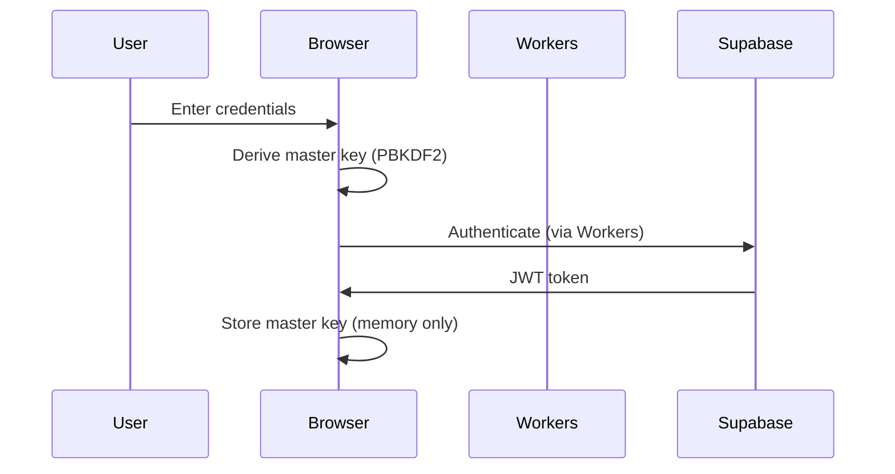

# Contributing to Abyrith Documentation

Welcome! We're glad you're here. This guide will help you contribute to the Abyrith documentation repository effectively and confidently.

**Our Mission:** Make software creation as accessible as having a conversation, while delivering enterprise-grade results.

**This Repository:** Comprehensive documentation for the Abyrith AI-native secrets management platform. We're currently in the planning phase, building the foundation that will guide implementation.

---

## Table of Contents

- [How to Contribute](#how-to-contribute)
- [Documentation Principles](#documentation-principles)
- [Pull Request Process](#pull-request-process)
- [Documentation Standards](#documentation-standards)
- [Review Checklist](#review-checklist)
- [Code of Conduct](#code-of-conduct)
- [Getting Help](#getting-help)

---

## How to Contribute

### For New Contributors

**Welcome!** Contributing to documentation is one of the best ways to get started. Here's how:

1. **Understand the Project**
   - Read `README.md` for repository overview
   - Review `DOCUMENTATION-ROADMAP.md` to understand the strategic plan
   - Check `FOLDER-STRUCTURE.md` to see where things go
   - Skim `01-product/product-vision-strategy.md` to understand what we're building

2. **Find Something to Work On**
   - Check the issues tagged with `documentation` or `good first issue`
   - Look at `DOCUMENTATION-ROADMAP.md` for unchecked items in the current phase
   - Identify areas where documentation is missing or unclear
   - Ask in discussions if you're unsure where to start

3. **Before You Start**
   - Check if someone else is already working on it (comment on the issue)
   - Read the dependencies listed in `DOCUMENTATION-ROADMAP.md`
   - Review existing related documentation
   - Understand the phase-based approach (don't skip ahead!)

4. **Create Your Contribution**
   - Fork the repository
   - Create a feature branch: `git checkout -b docs/your-feature-name`
   - Write your documentation (see [Documentation Standards](#documentation-standards))
   - Ensure alignment with related documents (see [Review Checklist](#review-checklist))
   - Update `CHANGELOG.md` with your changes

5. **Submit Your Work**
   - Push to your fork
   - Open a pull request with a clear title and description
   - Reference any related issues
   - Wait for review and address feedback

### For Experienced Contributors

You know the drill, but here are Abyrith-specific guidelines:

- **Phase-Based Approach:** Follow the phases in `DOCUMENTATION-ROADMAP.md`. Phase 0 must be complete before Phase 1, etc.
- **Alignment is Critical:** Use `DOC-ALIGNMENT-CHECKLIST.md` to verify consistency across all related documents
- **Parallel Work:** Multiple people can work on different documents within the same phase simultaneously
- **Cross-References:** Always link to related documents; avoid duplicating information

---

## Documentation Principles

Our documentation follows these core principles (from `DOCUMENTATION-ROADMAP.md`):

### 1. Single Source of Truth
- Each concept is documented in ONE place
- Other documents reference that source, they don't duplicate it
- If information conflicts, one document is authoritative

**Example:**
```markdown
❌ Don't duplicate:
File A: "We use AES-256-GCM encryption"
File B: "We use AES-256-GCM encryption"

✅ Reference instead:
File A: "We use AES-256-GCM encryption (see encryption-specification.md for details)"
File B: "Encryption: See 03-security/encryption-specification.md"
```

### 2. Beginner-Friendly First
- Start with plain English explanations
- Add technical details after the concept is clear
- Test with non-technical readers when possible
- Define technical terms the first time they appear

**Example:**
```markdown
✅ Good:
"Row-Level Security (RLS) ensures users only see their own data. It's like having
separate filing cabinets for each person, even though they're all in the same database.

Technical detail: RLS is implemented using PostgreSQL policies that filter queries
based on the current user's session context..."

❌ Bad:
"RLS policies enforce tenant isolation via predicate pushdown in the query planner..."
```

### 3. Diagrams Required
- Complex systems need visual representation
- Use Mermaid for diagrams when possible (renders in GitHub)
- ASCII diagrams are acceptable for simple flows
- Always include alt text for accessibility

### 4. Examples Over Explanations
- Show concrete examples before abstract concepts
- Include code snippets for technical implementations
- Provide real-world use cases
- Use "before and after" comparisons

### 5. Explicit Dependencies
- Always list what must exist before implementation
- Reference dependency documents in the version header
- Check dependencies exist before creating new docs
- Update dependents when a document changes

### 6. AI-Readable
- Use clear structure and consistent formatting
- Include structured metadata (version headers)
- Organize with clear headings and sections
- Make it easy for AI assistants to parse and understand

---

## Pull Request Process

### Phase-Based Workflow

We follow a strict phase-based approach to ensure documentation is built in the correct order:

```
Phase 0 (Admin/Core) → Phase 1 (Security) → Phase 2 (Database) →
Phase 3 (API/Infrastructure) → Phase 4 (Features) → ... → Phase 10 (User Docs)
```

**Before starting work:**
1. Check which phase we're currently in (see `DOCUMENTATION-ROADMAP.md`)
2. Ensure all dependencies from previous phases are complete
3. Verify you're not skipping ahead to a later phase

### Creating a Great Pull Request

#### PR Title Format

Use these prefixes for clarity:

- `docs: ` - New documentation or significant additions
- `docs(fix): ` - Corrections, typo fixes, minor updates
- `docs(update): ` - Updates to existing documentation
- `docs(align): ` - Alignment fixes across multiple documents
- `docs(refactor): ` - Restructuring or reorganization

**Examples:**
```
✅ Good:
- docs: Add security model and zero-knowledge architecture
- docs(fix): Correct AES-GCM parameters in encryption spec
- docs(update): Expand API authentication flow with OAuth examples
- docs(align): Ensure database schemas match API endpoint specs

❌ Bad:
- Updated docs
- Fixed stuff
- Documentation
- Changes
```

#### PR Description Template

Use this template for your PR description:

```markdown
## Summary
[2-3 sentences describing what this PR adds/changes]

## Documentation Added/Changed
- `/path/to/doc1.md` - [Brief description]
- `/path/to/doc2.md` - [Brief description]

## Phase & Dependencies
- Phase: [0-10]
- Dependencies: [List documents this depends on]
- Blockers: [Any blockers or issues]

## Alignment Checks
- [ ] All version headers present
- [ ] Cross-references updated
- [ ] CHANGELOG.md updated
- [ ] Terminology matches GLOSSARY.md
- [ ] Tech stack versions match TECH-STACK.md
- [ ] No contradictions with existing docs

## Related Issues
Closes #[issue number]
Related to #[issue number]

## Testing
- [ ] Read by someone unfamiliar with the topic
- [ ] Links verified
- [ ] Code examples tested (if applicable)
- [ ] Diagrams render correctly

## Additional Context
[Any additional information reviewers should know]
```

### Example Pull Requests

**Example 1: Adding Security Documentation (Phase 1)**
```markdown
Title: docs: Add security model and encryption specification

## Summary
Adds comprehensive security model documentation and detailed encryption
specification as part of Phase 1. Defines zero-knowledge architecture,
encryption algorithms, and key derivation approach.

## Documentation Added/Changed
- `03-security/security-model.md` - Comprehensive security architecture
- `03-security/encryption-specification.md` - AES-256-GCM implementation details
- `03-security/zero-knowledge-architecture.md` - Zero-knowledge system design

## Phase & Dependencies
- Phase: 1 (Security & Auth Foundation)
- Dependencies: GLOSSARY.md, TECH-STACK.md
- Blockers: None

## Alignment Checks
- [x] All version headers present
- [x] Cross-references updated
- [x] CHANGELOG.md updated
- [x] Terminology matches GLOSSARY.md
- [x] Tech stack versions match TECH-STACK.md (WebCrypto API, PBKDF2, AES-256-GCM)
- [x] No contradictions with existing docs

## Related Issues
Closes #15
Part of Phase 1 milestone

## Testing
- [x] Reviewed by security-focused team member
- [x] All technical terms defined in GLOSSARY.md
- [x] Encryption parameters match TECH-STACK.md
- [x] Links to NIST standards verified

## Additional Context
This establishes the security foundation that all subsequent phases will build upon.
Phase 2 (Database) cannot begin until this is approved and merged.
```

**Example 2: Fixing Alignment Issues**
```markdown
Title: docs(align): Update API docs to match database schema changes

## Summary
Database schemas were updated in #42 but API endpoint docs weren't updated to match.
This PR ensures consistency across database and API layers.

## Documentation Added/Changed
- `05-api/endpoints/secrets-endpoints.md` - Updated request/response schemas
- `05-api/endpoints/projects-endpoints.md` - Aligned with new environments table
- `04-database/schemas/secrets-metadata.md` - Added cross-reference to API docs

## Phase & Dependencies
- Phase: 3 (API & Infrastructure)
- Dependencies: 04-database/schemas/*.md files
- Blockers: None

## Alignment Checks
- [x] All version headers present and versions bumped
- [x] Cross-references updated
- [x] CHANGELOG.md updated
- [x] Field names match between database and API
- [x] Data types consistent (UUIDs, timestamps)
- [x] RLS policies referenced correctly

## Related Issues
Fixes #48 (Alignment issue)
Related to #42 (Original schema change)

## Testing
- [x] Verified all field names match
- [x] Checked data types are consistent
- [x] Confirmed no new contradictions introduced

## Additional Context
This was caught during alignment review. Good example of why we check
alignment before marking phases complete.
```

### Review Process

**What Reviewers Look For:**

1. **Correctness**
   - Information is accurate and up-to-date
   - Technical details match decisions in other documents
   - Examples work as described

2. **Completeness**
   - All required sections present (see version header template)
   - Dependencies clearly stated
   - Cross-references included

3. **Clarity**
   - Written for the target audience
   - Technical terms defined or linked to GLOSSARY
   - Examples illustrate concepts effectively

4. **Alignment**
   - No contradictions with existing documentation
   - Technology versions match TECH-STACK.md
   - Terminology matches GLOSSARY.md
   - Cross-references are valid

5. **Standards Compliance**
   - Version header present and correct
   - File naming follows conventions (kebab-case)
   - Placed in correct folder per FOLDER-STRUCTURE.md
   - CHANGELOG.md updated

**Review Timeline:**
- Initial review: Within 2 business days
- Feedback response: Within 1 business day
- Final approval: Within 1 business day after changes

**Approval Requirements:**
- All documentation: 1 approval from documentation owner
- Security docs (Phase 1, 3, 7): +1 approval from Security Lead
- API/Database docs (Phase 2, 3): +1 approval from Backend Lead
- Feature docs (Phase 4): +1 approval from Product Lead
- Phase completion: Engineering Lead final approval

---

## Documentation Standards

### Version Header Template

**Every Markdown file MUST include a version header:**

```markdown
---
Document: [Descriptive Document Name]
Version: X.Y.Z
Last Updated: YYYY-MM-DD
Owner: [Team/Person]
Status: Draft | Review | Approved | Deprecated
Dependencies: [file1.md, file2.md, file3.md]
---
```

**Version Number Guidelines (Semantic Versioning):**
- **Major (X.0.0):** Breaking changes, complete rewrites, architectural shifts
- **Minor (X.Y.0):** New sections, significant additions, feature documentation
- **Patch (X.Y.Z):** Typo fixes, clarifications, minor updates

**Examples:**
```markdown
1.0.0 → 1.0.1: Fixed typos in encryption algorithm description (Patch)
1.0.1 → 1.1.0: Added new section on key rotation strategy (Minor)
1.1.0 → 2.0.0: Complete rewrite of security model after architecture change (Major)
```

**Status Values:**
- **Draft:** Work in progress, not yet ready for review
- **Review:** Ready for team review
- **Approved:** Reviewed and approved, ready for implementation
- **Deprecated:** No longer current, superseded by another document

### File Naming Conventions

**Use kebab-case for all files:**
```
✅ Good:
- security-model.md
- api-rest-endpoints.md
- database-schema-secrets.md

❌ Bad:
- SecurityModel.md
- API_REST_Endpoints.md
- database schema secrets.md
```

**Prefix by category when appropriate:**
```
Architecture:  arch-security-model.md
Database:      db-schema-secrets.md
Feature:       feature-ai-assistant.md
API:           api-rest-endpoints.md
Operations:    ops-deployment-runbook.md
```

**For folders, use numbered prefixes:**
```
00-admin/
01-product/
02-architecture/
03-security/
...
12-user-docs/
```

### Document Structure Template

**Standard structure for all documentation:**

```markdown
---
[Version Header]
---

# Document Title

## Overview
[2-3 sentence summary - what is this document about?]

## Table of Contents
- [Section 1](#section-1)
- [Section 2](#section-2)

## [Main Content Sections]

### Section 1
[Content]

### Section 2
[Content]

## Dependencies
[What must exist before this can be implemented?]
- Dependency 1: [Brief explanation]
- Dependency 2: [Brief explanation]

## References
[Links to related documents]
- [Related Doc 1](../path/to/doc1.md)
- [Related Doc 2](../path/to/doc2.md)

## Change Log
| Version | Date       | Author | Changes                |
|---------|------------|--------|------------------------|
| 1.0.0   | 2025-10-29 | Name   | Initial version        |
```

### Terminology Consistency

**Always use terms from GLOSSARY.md:**

When referencing key concepts, use the standard terminology:
- MCP (Model Context Protocol) - not "model protocol" or "Claude integration"
- Zero-Knowledge Encryption - not "client-side encryption" alone
- RLS (Row-Level Security) - not "row level security" spelled out
- Projects, Environments, Secrets - specific capitalization
- Roles: Owner, Admin, Developer, Read-Only

**If introducing a new term:**
1. Add it to `GLOSSARY.md` first
2. Link to the glossary on first use in your document
3. Use consistently throughout

### Code Examples

**Include working code examples:**

```markdown
## Example: Encrypting a Secret

```typescript
import { webcrypto } from 'crypto';

async function encryptSecret(plaintext: string, masterKey: CryptoKey): Promise<EncryptedData> {
  // Generate random IV
  const iv = webcrypto.getRandomValues(new Uint8Array(12));

  // Encrypt using AES-256-GCM
  const encrypted = await webcrypto.subtle.encrypt(
    { name: 'AES-GCM', iv },
    masterKey,
    new TextEncoder().encode(plaintext)
  );

  return {
    ciphertext: Buffer.from(encrypted).toString('base64'),
    iv: Buffer.from(iv).toString('base64'),
    algorithm: 'AES-256-GCM'
  };
}
```
```

**Code example guidelines:**
- Include necessary imports
- Use TypeScript for type safety
- Add comments for clarity
- Show realistic examples, not simplified pseudo-code
- Test that examples actually work

### Diagrams

**Use Mermaid for diagrams when possible:**

```markdown
## Authentication Flow


```

**For complex diagrams:**
- Use descriptive labels
- Keep it simple and focused
- Include a legend if needed
- Provide alt text for accessibility

### Cross-References

**Link to related documents:**

```markdown
## Related Documentation

This authentication flow integrates with:
- [Security Model](../03-security/security-model.md) - Overall security architecture
- [Database Schema](../04-database/schemas/users-organizations.md) - User data model
- [API Endpoints](../05-api/endpoints/auth-endpoints.md) - Authentication API

See also:
- [OAuth Setup](./oauth-setup.md) for third-party authentication
- [MFA Implementation](./mfa-implementation.md) for multi-factor authentication
```

**Cross-reference guidelines:**
- Use relative paths: `../folder/file.md`
- Include context (what the link is about)
- Verify links work before submitting PR
- Update references when moving files

---

## Review Checklist

### For Authors (Before Submitting PR)

**Content Quality:**
- [ ] Document has clear version header with all fields filled
- [ ] Overview section provides 2-3 sentence summary
- [ ] All technical terms defined or linked to GLOSSARY.md
- [ ] Code examples are tested and working
- [ ] Diagrams included for complex concepts
- [ ] Dependencies explicitly listed
- [ ] Change log updated

**Standards Compliance:**
- [ ] File name uses kebab-case
- [ ] File placed in correct folder per FOLDER-STRUCTURE.md
- [ ] Follows document structure template
- [ ] Cross-references use relative paths
- [ ] CHANGELOG.md updated with changes

**Alignment:**
- [ ] Read all dependency documents
- [ ] No contradictions with existing documentation
- [ ] Technology versions match TECH-STACK.md
- [ ] Terminology matches GLOSSARY.md
- [ ] API docs match database schemas (if applicable)
- [ ] Security requirements consistent across all docs

**Accessibility:**
- [ ] Beginner-friendly language used
- [ ] Technical details explained, not assumed
- [ ] Examples show concrete use cases
- [ ] Diagrams have descriptive labels
- [ ] Links have descriptive text (not "click here")

### For Reviewers

**First Pass (Quick Check):**
- [ ] PR title follows format guidelines
- [ ] PR description is complete
- [ ] Version header present and correct
- [ ] File naming and location correct
- [ ] CHANGELOG.md updated

**Content Review:**
- [ ] Information is accurate and current
- [ ] Explanations are clear and beginner-friendly
- [ ] Technical details are correct
- [ ] Examples work as described
- [ ] Diagrams are clear and helpful

**Alignment Review:**
- [ ] No contradictions with existing docs
- [ ] Dependencies are correct and exist
- [ ] Cross-references are valid
- [ ] Terminology consistent with GLOSSARY.md
- [ ] Technology versions match TECH-STACK.md

**Security Review (for security-related docs):**
- [ ] Security requirements are correct
- [ ] No security anti-patterns introduced
- [ ] Encryption parameters match specifications
- [ ] Zero-knowledge principle maintained
- [ ] Threat model considerations addressed

**Phase Completeness Review (for phase transitions):**
- [ ] All documents in phase created
- [ ] All dependencies satisfied
- [ ] Alignment checks passed
- [ ] No blocking issues remain
- [ ] Ready for next phase to begin

---

## Code of Conduct

### Our Commitment

We are committed to providing a welcoming, inclusive, and harassment-free experience for everyone, regardless of age, body size, disability, ethnicity, gender identity and expression, level of experience, nationality, personal appearance, race, religion, or sexual identity and orientation.

### Our Standards

**Positive behaviors include:**
- Using welcoming and inclusive language
- Being respectful of differing viewpoints and experiences
- Gracefully accepting constructive criticism
- Focusing on what is best for the community
- Showing empathy towards other community members
- Assuming good intent

**Unacceptable behaviors include:**
- Harassment, intimidation, or discrimination of any kind
- Trolling, insulting/derogatory comments, and personal attacks
- Public or private harassment
- Publishing others' private information without permission
- Other conduct which could reasonably be considered inappropriate

### In Code Reviews

**Be kind and constructive:**
```markdown
❌ Bad:
"This is wrong. Did you even read the docs?"

✅ Good:
"I think there might be a mismatch here with the security model doc.
Could we align this with the encryption parameters specified in
03-security/encryption-specification.md?"
```

**Ask questions, don't make demands:**
```markdown
❌ Bad:
"Change this to use kebab-case."

✅ Good:
"Should this file name use kebab-case to match our naming conventions
in FOLDER-STRUCTURE.md?"
```

**Explain the "why":**
```markdown
❌ Bad:
"You need to add a version header."

✅ Good:
"Let's add a version header here so we can track changes over time.
See the template in CONTRIBUTING.md. This helps us maintain documentation
versions as the project evolves."
```

**Celebrate good work:**
```markdown
✅ Great:
"This explanation of zero-knowledge encryption is really clear!
I think beginners will find this helpful. Nice work!"
```

### Enforcement

Project maintainers are responsible for clarifying standards of acceptable behavior and will take appropriate and fair corrective action in response to any instances of unacceptable behavior.

If you experience or witness unacceptable behavior, please report it to the project maintainers. All complaints will be reviewed and investigated promptly and fairly.

---

## Getting Help

### Where to Ask Questions

**For general questions:**
- Open a Discussion in the GitHub Discussions tab
- Tag with appropriate labels (documentation, question, help wanted)

**For specific issues:**
- Check existing Issues first to avoid duplicates
- Open a new Issue with:
  - Clear title describing the question
  - Context (what you're trying to do)
  - What you've already tried
  - Relevant documents or sections

**For urgent clarifications:**
- Comment directly on the relevant PR
- Tag the document owner (see version header)
- Mention @engineering-lead for phase-related questions

### Documentation Resources

**Essential reading for contributors:**
- `README.md` - Repository overview and quick start
- `DOCUMENTATION-ROADMAP.md` - Strategic plan and phase breakdown
- `FOLDER-STRUCTURE.md` - Where to put files
- `DOC-ALIGNMENT-CHECKLIST.md` - How to ensure consistency
- `CLAUDE.md` - Guidance for AI-assisted contributions
- `01-product/team-playbook.md` - Core principles and values

**Quick reference:**
- `TECH-STACK.md` - Technology choices and versions
- `GLOSSARY.md` - Standard terminology (create in Phase 0)
- `CHANGELOG.md` - Recent changes and updates

### Common Questions

**Q: Which phase should I work on?**
A: Check `DOCUMENTATION-ROADMAP.md` for the current phase. Generally, work on the earliest incomplete phase. Don't skip ahead!

**Q: How do I know what dependencies a document has?**
A: Check the version header of the document and look at the "Dependencies" field. Also see `DOCUMENTATION-ROADMAP.md` for phase dependencies.

**Q: What if I find contradictions between documents?**
A: Great catch! Open an Issue tagged with "alignment" and reference both documents. Use `DOC-ALIGNMENT-CHECKLIST.md` to identify which is authoritative.

**Q: Can I work on multiple documents in parallel?**
A: Yes! Within a phase, multiple documents can be worked on simultaneously. Just make sure dependencies are satisfied.

**Q: How do I test documentation?**
A: Ask someone unfamiliar with the topic to read it. Can they understand it? Check all links work. Test code examples. Verify diagrams render correctly.

**Q: What if I disagree with a documented decision?**
A: Open a Discussion to talk about it. Explain your reasoning and propose an alternative. Reference our decision-making framework in the team playbook. Once a decision is made, everyone commits (disagree and commit).

**Q: How long should documentation be?**
A: As long as necessary, as short as possible. If it's over 500 lines, consider splitting into multiple documents. If it's under 100 lines, consider if it could be merged with related content.

---

## Thank You

Thank you for contributing to Abyrith! Every contribution, no matter how small, helps make the platform better for everyone—from beginners taking their first steps in coding to enterprise teams managing critical infrastructure.

Your documentation helps ensure that when we build Abyrith, we build it right. Clear, comprehensive documentation now means faster, more accurate implementation later.

**Together, we're making software creation as accessible as having a conversation.**

Questions? Open a Discussion. Ready to contribute? Check out the open issues!

---

**Remember:** Good documentation is like good code—write it once, maintain it continuously, refactor when it gets messy.

Let's build great documentation for a great platform. 🚀
