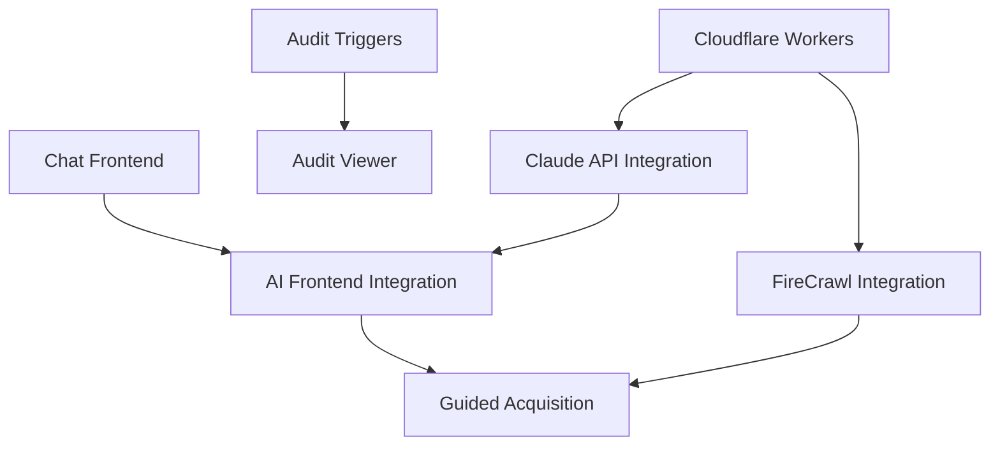

# Abyrith MVP Implementation Plan
**Project Leader:** Claude Code
**Created:** 2025-11-02
**Target Completion:** 3 weeks (21 days)
**Status:** APPROVED - EXECUTION PHASE

---

## Executive Summary

This plan outlines the critical path to MVP completion for Abyrith, focusing on the three P0 features identified in the audit:
1. **AI Assistant** (core differentiator)
2. **Cloudflare Workers** (infrastructure)
3. **Audit Logging** (compliance)

**Strategy:** Parallel development across independent workstreams with clear integration points.

---

## Phase 1: Foundation & Infrastructure (Week 1 - Days 1-7)

### Workstream 1: Cloudflare Workers Infrastructure
**Owner:** Backend Team Agent
**Priority:** P0 (Blocker for AI features)
**Effort:** 5 days

**Scope:**
- API Gateway routing with Hono framework
- Rate limiting with KV storage
- JWT validation middleware
- CORS and security headers
- Error handling and logging
- Health check endpoints

**Deliverables:**
```
workers/src/
├── index.ts (main router)
├── middleware/
│   ├── auth.ts (JWT validation)
│   ├── rate-limit.ts (KV-based rate limiting)
│   ├── cors.ts (CORS headers)
│   └── error-handler.ts (unified error handling)
├── lib/
│   ├── jwt.ts (token utilities)
│   └── kv.ts (KV storage helpers)
└── types/
    └── api.ts (request/response types)
```

**Success Criteria:**
- [ ] `/health` endpoint returns 200
- [ ] Rate limiting blocks after threshold
- [ ] JWT validation rejects invalid tokens
- [ ] All requests have proper CORS headers

---

### Workstream 2: AI Chat Frontend Components
**Owner:** Frontend Team Agent
**Priority:** P0
**Effort:** 4 days

**Scope:**
- Chat interface component (message list, input, controls)
- Message bubbles (user, AI, system)
- Typing indicators and loading states
- Context panel (shows current project/secret)
- Integration with auth and project stores

**Deliverables:**
```
components/ai/
├── ChatInterface.tsx (main container)
├── ChatMessage.tsx (message bubble component)
├── ChatInput.tsx (input with send button)
├── TypingIndicator.tsx (animated dots)
├── ContextPanel.tsx (shows current context)
└── ChatHistory.tsx (conversation list)

lib/stores/
└── ai-store.ts (Zustand store for AI state)
```

**Success Criteria:**
- [ ] Can send messages and display responses
- [ ] Typing indicators work
- [ ] Context panel shows current project
- [ ] Messages persist in conversation

---

### Workstream 3: Audit Logging Implementation
**Owner:** Database Team Agent
**Priority:** P0
**Effort:** 3 days

**Scope:**
- Database triggers for all CRUD operations
- Audit log viewer component
- Log filtering and search
- Export functionality

**Deliverables:**
```
supabase/migrations/
└── 20240104000006_audit_triggers.sql

components/audit/
├── AuditLogViewer.tsx (main viewer)
├── AuditLogTable.tsx (table component)
└── AuditLogFilters.tsx (filter controls)

lib/api/
└── audit.ts (fetch audit logs)
```

**Success Criteria:**
- [ ] All secret CRUD operations logged
- [ ] All project operations logged
- [ ] Logs show user, action, timestamp
- [ ] Can filter by date, user, action type

---

### Workstream 4: FireCrawl Integration Preparation
**Owner:** Integration Team Agent
**Priority:** P1
**Effort:** 2 days

**Scope:**
- FireCrawl API client wrapper
- Caching layer with KV
- URL validation and sanitization
- Error handling for API failures

**Deliverables:**
```
workers/src/services/
├── firecrawl.ts (API client)
└── documentation-scraper.ts (scraping logic)

workers/src/handlers/
└── scrape.ts (scrape endpoint handler)
```

**Success Criteria:**
- [ ] Can scrape a documentation URL
- [ ] Results cached in KV for 24 hours
- [ ] Handles rate limits gracefully
- [ ] Returns structured markdown

---

## Phase 2: AI Integration (Week 2 - Days 8-14)

### Workstream 5: Claude API Integration
**Owner:** AI Team Agent
**Priority:** P0
**Effort:** 5 days

**Scope:**
- Claude API client in Workers
- Conversation management system
- Prompt engineering for guided acquisition
- Streaming responses
- Cost tracking

**Deliverables:**
```
workers/src/services/
├── claude.ts (Claude API client)
├── prompts.ts (system prompts)
└── conversation.ts (conversation logic)

workers/src/handlers/
└── ai-chat.ts (chat endpoint)

supabase/migrations/
└── 20240105000001_conversation_functions.sql
```

**Success Criteria:**
- [ ] Can send messages to Claude API
- [ ] Streaming responses work
- [ ] Conversations persist in database
- [ ] Token usage tracked per conversation

---

### Workstream 6: AI Frontend-Backend Integration
**Owner:** Full-Stack Integration Agent
**Priority:** P0
**Effort:** 3 days

**Scope:**
- Connect frontend chat to Workers API
- WebSocket/SSE for streaming
- Error handling and retries
- Loading and error states

**Deliverables:**
```
lib/api/
└── ai.ts (AI API client)

lib/hooks/
└── use-ai-chat.ts (React hook for chat)

app/dashboard/ai/
└── page.tsx (AI assistant page)
```

**Success Criteria:**
- [ ] Messages sent from UI reach Claude API
- [ ] Streaming responses appear in real-time
- [ ] Errors shown to user with retry option
- [ ] Works across page refreshes

---

### Workstream 7: Guided Acquisition Flow
**Owner:** Product Features Agent
**Priority:** P0
**Effort:** 4 days

**Scope:**
- Multi-step wizard UI
- Service detection (auto-detect from project name)
- Documentation scraping integration
- Step-by-step guidance generation
- Save acquired key to secrets

**Deliverables:**
```
components/ai/
├── GuidedAcquisition.tsx (wizard container)
├── ServiceSelector.tsx (choose service)
├── StepViewer.tsx (show acquisition steps)
└── KeyValidator.tsx (validate acquired key)

lib/services/
└── service-detection.ts (detect service from name)
```

**Success Criteria:**
- [ ] Can start acquisition flow for common services
- [ ] AI generates step-by-step instructions
- [ ] Can scrape docs for reference
- [ ] Acquired key saved to correct environment

---

## Phase 3: Polish & Testing (Week 3 - Days 15-21)

### Workstream 8: Error Tracking & Monitoring
**Owner:** DevOps Agent
**Priority:** P1
**Effort:** 2 days

**Scope:**
- Sentry integration
- Performance monitoring
- Error boundaries in React
- Cloudflare Workers error tracking

**Deliverables:**
```
lib/monitoring/
├── sentry.ts (Sentry client)
└── performance.ts (performance tracking)

components/
└── ErrorBoundary.tsx (React error boundary)
```

---

### Workstream 9: Team Management UI
**Owner:** Frontend Team Agent
**Priority:** P1
**Effort:** 3 days

**Scope:**
- Organization members list
- Invite member dialog
- Role management UI
- Remove member confirmation

**Deliverables:**
```
app/dashboard/team/
└── page.tsx (team management page)

components/team/
├── MemberList.tsx (list members)
├── InviteMemberDialog.tsx (invite dialog)
└── RoleBadge.tsx (role indicator)
```

---

### Workstream 10: Documentation Alignment
**Owner:** Documentation Agent
**Priority:** P2
**Effort:** 2 days

**Scope:**
- Update docs to match implementation
- Fix schema naming inconsistencies
- Add implementation notes
- Update TECH-STACK.md

---

## Integration Points & Dependencies

### Critical Dependencies:


### Integration Checkpoints:
- **Day 7:** Workers + Frontend both complete, integration test
- **Day 14:** Full AI flow working end-to-end
- **Day 21:** All features tested and documented

---

## Resource Allocation

### Parallel Development Teams (Claude Code Agents):
1. **Backend Infrastructure Team** - Workers, middleware, services
2. **Frontend Components Team** - UI components, pages, hooks
3. **Database Team** - Migrations, triggers, functions
4. **AI Integration Team** - Claude API, prompts, conversation logic
5. **Product Features Team** - Guided acquisition, workflows
6. **DevOps Team** - Monitoring, error tracking, deployment

---

## Success Metrics

### Week 1 Goals:
- [ ] Workers API responding with rate limiting
- [ ] Chat UI renders and accepts input
- [ ] Audit logs capturing all operations
- [ ] FireCrawl can scrape docs

### Week 2 Goals:
- [ ] Can have AI conversation in UI
- [ ] Guided acquisition generates steps
- [ ] Streaming responses working
- [ ] Keys saved from acquisition flow

### Week 3 Goals:
- [ ] Error tracking active in production
- [ ] Team management working
- [ ] All documentation aligned
- [ ] Performance benchmarks met

---

## Risk Mitigation

### High-Risk Areas:
1. **Claude API Rate Limits** - Implement exponential backoff
2. **Streaming Complexity** - Have fallback to non-streaming
3. **FireCrawl Failures** - Graceful degradation with manual input
4. **Workers Cold Starts** - Keep-alive pings

### Contingency Plans:
- If Claude API unavailable → Use cached responses for demo
- If FireCrawl fails → Allow manual documentation input
- If streaming breaks → Fall back to request/response

---

## Definition of Done

### MVP is complete when:
- [ ] User can sign up and create account
- [ ] User can set master password
- [ ] User can create project and environments
- [ ] User can add secrets manually
- [ ] User can chat with AI assistant
- [ ] AI can guide user to acquire API key
- [ ] AI can scrape documentation for reference
- [ ] All operations appear in audit log
- [ ] Team members can be invited
- [ ] Errors tracked in Sentry
- [ ] Performance meets targets (<2s page load)
- [ ] Security audit passes (RLS, encryption)

---

## Timeline Summary

| Week | Focus | Deliverables | Completion % |
|------|-------|--------------|--------------|
| Week 1 | Infrastructure | Workers, UI, Audit, FireCrawl | 60% |
| Week 2 | AI Integration | Claude API, Streaming, Acquisition | 90% |
| Week 3 | Polish & Launch | Monitoring, Teams, Docs | 100% |

**Target Launch Date:** Day 21 (3 weeks from now)

---

## Next Actions (Immediate)

1. **Deploy 4 parallel agent teams** for Week 1 workstreams
2. **Create feature branches** for each workstream
3. **Set up daily integration tests**
4. **Schedule Day 7 checkpoint** for integration review

---

**Status:** ✅ APPROVED - Ready for execution
**Signed:** Project Leader (Claude Code)
**Date:** 2025-11-02
